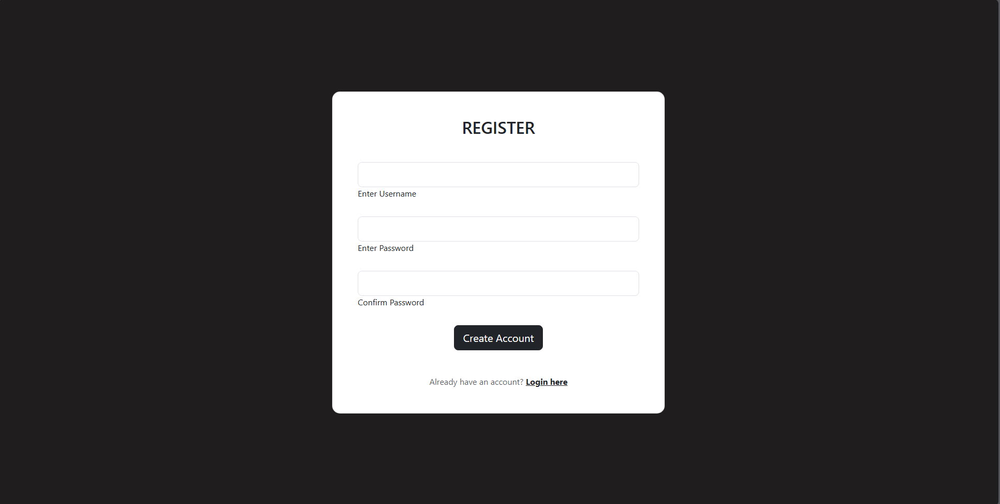

# Notes App

A simple Notes application built using **React** for the frontend and **Django** for the backend. This app allows users to register, log in, create notes, and view a list of their saved notes, all while utilizing Django's built-in admin panel for management.

## Features
- User Authentication (Login, Register, Logout)
- Add Notes
- View Notes List
- Django Admin Panel for management

## Tech Stack

### Backend (Django)
- Django
- Django REST Framework
- Django CORS Headers
- djangorestframework-simplejwt
- PyJWT
- psycopg2-binary
- python-dotenv

### Frontend (React)
- React
- Axios
- React Router DOM
- JWT Decode

## Installation

### Backend Setup
1. Clone the repository:
   ```sh
   git clone https://github.com/yourusername/notes-app.git
   cd notes-app/backend
   ```
2. Create and activate a virtual environment:
   ```sh
   python -m venv venv
   source venv/bin/activate  # On Windows use `venv\Scripts\activate`
   ```
3. Install dependencies:
   ```sh
   pip install -r requirements.txt
   ```
4. Set up environment variables:
   - Create a `.env` file in the backend directory
   - Add necessary configurations like database settings and JWT secret key
5. Run database migrations:
   ```sh
   python manage.py migrate
   ```
6. Start the Django server:
   ```sh
   python manage.py runserver
   ```

### Frontend Setup
1. Create React App
   ```sh
   npm create vite@latest
   ```
2. Navigate to the frontend directory:
   ```sh
   cd ../frontend
   ``
3. Install dependencies:
   ```sh
   npm install react-router-dom jwt-decode axios
   ```
4. Start the React development server:
   ```sh
   npm start
   ```

## API Endpoints
| Method | Endpoint          | Description          |
|--------|------------------|----------------------|
| POST   | `/api/login/`    | User login          |
| POST   | `/api/register/` | User registration   |
| GET    | `/api/notes/`    | Retrieve all notes  |
| POST   | `/api/notes/`    | Add a new note      |
| DELETE | `/api/notes/:id` | Delete a note       |

## Screenshots
### Login Page


### Register Page


### Notes List


### Add Note


### Delete Note


### Edit Note


## Contributing
Feel free to submit issues and pull requests to improve this project.

## License
This project is licensed under the MIT License.

